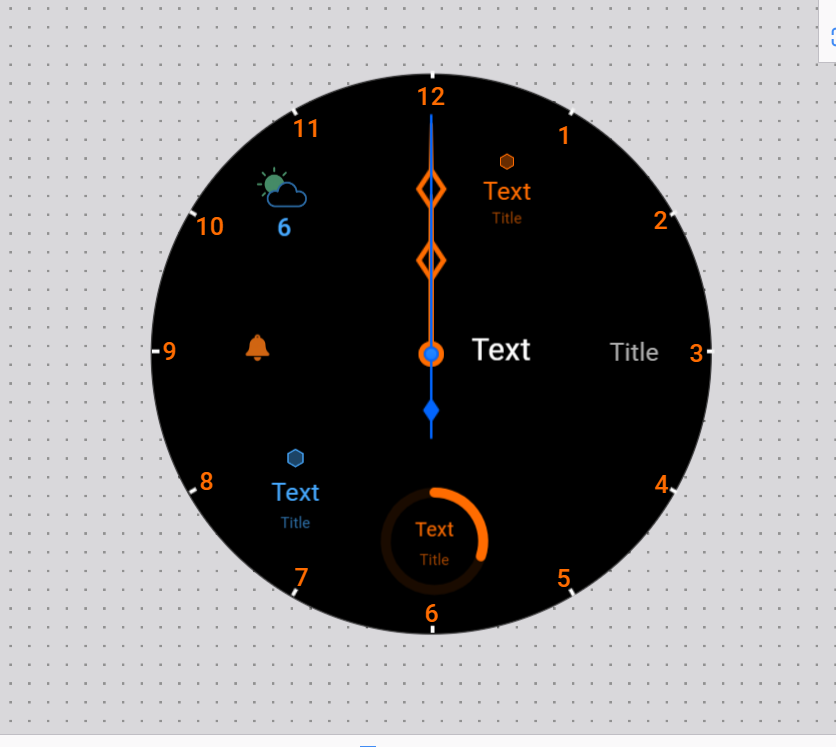
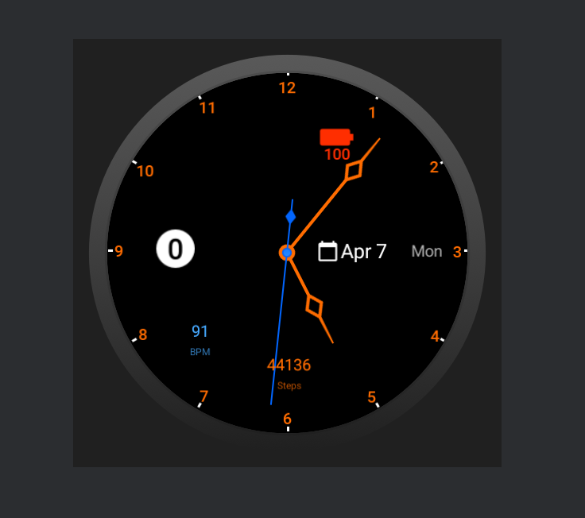

# ⌚ Watch Face Design – Wear OS Analog Watch Face

## 🎯 Project Overview

This is a custom-designed analog smartwatch face created using [Watch Face Studio](https://developer.samsung.com/watch-face-studio/). The project demonstrates real-time timekeeping, integration of multiple Wear OS complications, and a polished UI using built-in design resources.

---

## 🧩 Features

- 🕒 Analog Clock Hands (Hour, Minute, Second)
- 🔢 Circular Hour Digit Layout
- 🔋 Real-time Battery Percentage with Icon
- 👟 Live Step Count
- ❤️ Heart Rate Monitor
- 📅 Date & Day Display

---

## 🎨 Design Theme

- **Primary Color:** `#FF6C00` (Orange)
- **Background:** Solid Black
- **Font:** Roboto / Samsung Sans
- **Style:** Flat, Modern, and Readable

---

## 🛠️ Technologies Used

| Tool               | Purpose                     |
|--------------------|-----------------------------|
| Watch Face Studio  | Design & Development        |
| Wear OS Emulator   | Testing & Validation        |
| Tags & Complications | Live data integration     |

---

## 📸 Preview

| Watch Face Design | Live Data on Emulator |
|-------------------|------------------------|
|  |  |

---

## 🧪 How to Run

1. Open the `.wfs` project file in Watch Face Studio
2. Run on Wear OS Emulator or a connected device
3. For weather: long-press the watch face → Customize → Assign weather provider
4. Use the time slider in WFS to simulate analog hand motion

---

## 🙌 Acknowledgements

Thanks to the instructors for guidance and Watch Face Studio for enabling rapid smartwatch UI development.

---
